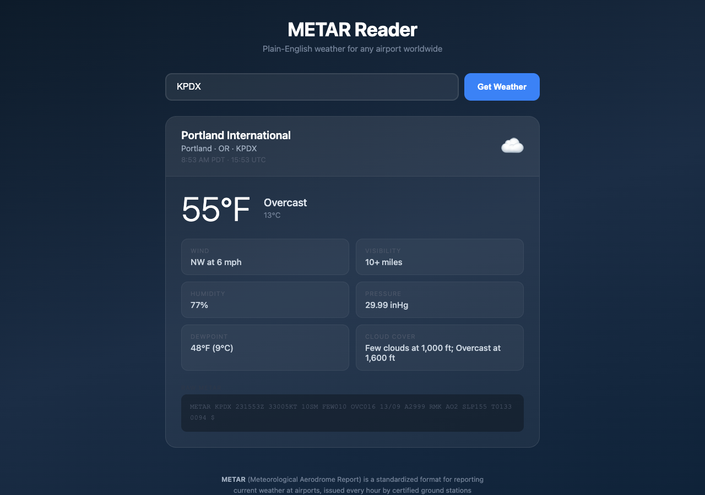

# METAR Reader

A web application that translates live airport weather reports into plain, everyday English. Type an airport name or code and instantly get a friendly, readable weather summary — no aviation knowledge required.

 

**Live demo:** https://metar-reader-production.up.railway.app



---

## What is METAR?

METAR (Meteorological Aerodrome Report) is the global standard format for reporting current weather conditions at airports. It is issued every hour (or more frequently when conditions change rapidly) by certified ground stations at thousands of airports worldwide.

A raw METAR looks like this:

```
METAR KPDX 210253Z 33009G15KT 10SM FEW047 BKN250 19/09 A3009
```

To most people, that's unreadable. METAR Reader decodes it into something like:

> **Portland International** · Portland, OR  
> **68°F** · Mostly cloudy  
> Wind: NW at 10 mph, gusting to 17 mph  
> Visibility: 10+ miles · Humidity: 51% · Pressure: 30.09 inHg

---

## Features

### Airport Search with Autocomplete
Start typing an airport name, city, or code and a dropdown of matching airports appears instantly. The search covers approximately 7,000 large and medium airports worldwide, sourced from the [OurAirports](https://ourairports.com) public dataset. Results are ranked so exact code matches appear first, followed by prefix matches, then name/city matches.

### Plain-English Weather Decoding
Every field in the METAR is translated into human-readable language:

- **Temperature** — displayed in °F (with °C alongside)
- **Feels like** — heat index when it's hot and humid, wind chill when it's cold and windy
- **Wind** — direction as a cardinal (N, NE, SW…), speed in mph, gusts if present, and variable sectors when the wind is shifting
- **Visibility** — in miles, including less-than values (e.g. "Less than ¼ mile")
- **Sky conditions** — Clear, Mostly clear, Partly cloudy, Mostly cloudy, Overcast, or Sky obscured, with cloud layer altitudes
- **Weather phenomena** — rain, snow, fog, thunderstorms, haze, and more — with intensity (Light / Heavy) and descriptors (Freezing, Blowing, Shower)
- **Humidity** — calculated from temperature and dewpoint using the Magnus formula
- **Pressure** — in inches of mercury (inHg)
- **Dewpoint** — in °F and °C

### Airport Name & Location
Instead of showing a raw code like `KPDX`, the app looks up the full airport name and city from the FAA/ICAO registry and displays it prominently in the card header.

### Local Time
The report time is shown in both UTC (as published in the METAR) and the airport's local time. Timezone is resolved automatically from the airport's state or province for US and Canadian airports.

### Weather Condition Icons
An emoji icon reflects the current sky and weather conditions at a glance — from ☀️ clear skies to ⛈️ thunderstorms and ❄️ snow.

### Raw METAR Display
The original, unmodified METAR string is shown at the bottom of the card for pilots, dispatchers, or anyone who wants to verify the source data.

---

## Prerequisites

- [Node.js](https://nodejs.org) **v18 or higher** (required for the built-in `fetch` API)
- npm (comes with Node.js)

---

## Installation

1. **Clone the repository**
   ```bash
   git clone https://github.com/Dima-Vasilyev/metar-reader.git
   cd metar-reader
   ```

2. **Install dependencies**
   ```bash
   npm install
   ```

3. **Start the server**
   ```bash
   npm start
   ```

4. **Open your browser** and navigate to:
   ```
   http://localhost:3000
   ```

---

## How to Use

1. **Search for an airport** — type a city name (e.g. `London`), an airport name (e.g. `Heathrow`), or a code (e.g. `EGLL` or `LHR`) into the search box
2. **Pick from the dropdown** — select your airport from the autocomplete suggestions, or press Enter if the code is already complete
3. **Read the weather report** — the card shows a full plain-English breakdown of current conditions at that airport

---

## Understanding the Weather Card

| Field | What it means |
|---|---|
| **Temperature** | Current air temperature in °F (and °C) |
| **Feels like** | Heat index (hot + humid) or wind chill (cold + windy) |
| **Wind** | Direction the wind is coming *from*, speed in mph, gusts if any |
| **Visibility** | How far you can see horizontally, in miles |
| **Humidity** | Relative humidity, calculated from temperature and dewpoint |
| **Pressure** | Atmospheric pressure in inches of mercury |
| **Dewpoint** | The temperature at which air becomes saturated — higher = more moisture |
| **Cloud cover** | Coverage and altitude of each cloud layer |
| **Weather chips** | Active phenomena like Rain, Snow, Fog, or Thunderstorms with intensity |
| **Raw METAR** | The original report string for reference |

---

## Airport Code Format

This app uses **ICAO codes** — the international 4-character identifiers assigned to airports by the International Civil Aviation Organization. Examples:

| ICAO | Airport |
|---|---|
| `KPDX` | Portland International, Oregon, USA |
| `EGLL` | London Heathrow, UK |
| `RJTT` | Tokyo Haneda, Japan |
| `YSSY` | Sydney Kingsford Smith, Australia |

The `K` prefix covers most airports in the contiguous United States. Other common prefixes: `E` (Northern Europe), `C` (Canada), `Y` (Australia), `R` (East Asia).

You can also search by **IATA code** (the 3-letter codes used on boarding passes, e.g. `PDX`, `LHR`) and the autocomplete will find the right airport.

---

## Data Sources

- **Weather data** — [aviationweather.gov](https://aviationweather.gov) (US National Weather Service / NOAA), public domain
- **Airport directory** — [OurAirports](https://ourairports.com) public dataset, released to the public domain

---

## Tech Stack

- **Runtime** — Node.js 18+
- **Server** — Express.js (serves static files + proxies external API calls to avoid CORS)
- **Frontend** — Vanilla HTML, CSS, and JavaScript — no frameworks or build tools
- **Styling** — Custom dark theme with CSS variables, fully responsive
